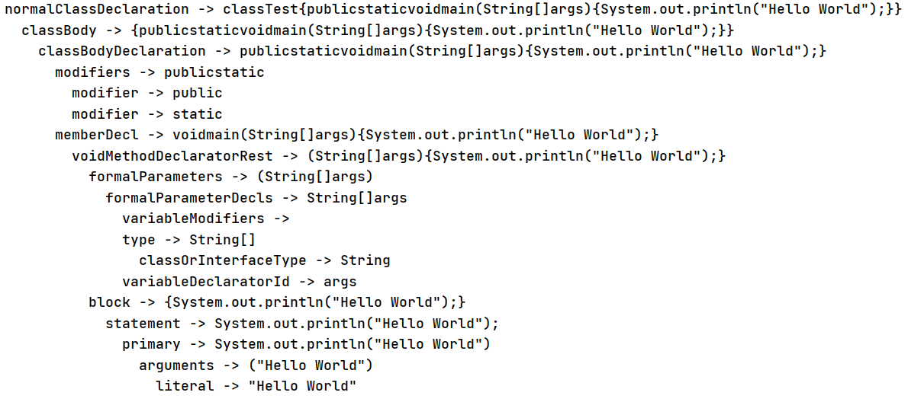

# ASTGenTest

一个通过ANTLR4生成AST的简易Demo

## 环境要求：

需要安装 ANTLR v4插件 或 ANTLR v4的jar包(后期应该主要用这个)，安装和配置见：https://github.com/antlr/antlr4/blob/master/doc/getting-started.md

## 基本流程：

1. 先获取Java语法文件，*.g4格式，对应Demo中src/main/resources/Java.g4。从这里可以找到各种语言的\*.g4文件：https://github.com/antlr/grammars-v4

2. 用ANTLR生成Lexer/Parser等文件，对应Demo中src/main/java/gen中的所有文件

3. 按照ASTGen.java中流程获取AST

## 执行结果：

目标代码：

```C++
class Test {
    /**
     * Target code
     * */
    public static void main(String[] args) {
        // comment test
        System.out.println("Hello World");
    }
}
```

输出：



## 一些小问题：

- 目标代码`Test.java`的类名前加`public`会提示`line 1:0 extraneous input 'public' expecting {'class', 'enum'}`

- 官方文档提到有几种访问AST的方式(listener/visitor/XPath/Tree pattern matching)，Demo中目前还未给出相关代码